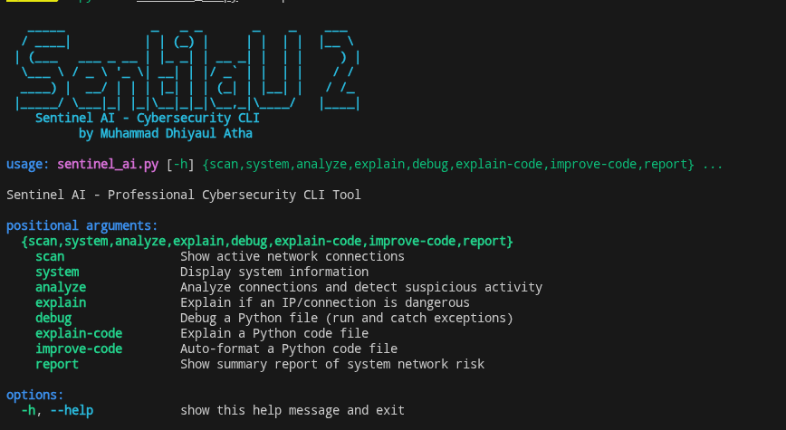

# Sentinel AI CLI

   

Sentinel AI CLI is a professional, open-source cybersecurity tool for Linux. It provides real-time network monitoring, system information, intelligent connection analysis, and risk classification to help you secure your machine—instantly from your terminal.

---


## Features

- **Network Scanner**: List all active network connections with process details
- **System Information**: Display OS, kernel, CPU, memory, and hostname
- **Connection Analyzer**: Detect and classify suspicious connections with numeric risk scoring (0–100) and risk level (LOW, MEDIUM, HIGH)
- **Report Command**: Show summary of total connections, external connections, risk counts, and overall system risk score
- **Explain Command**: Explain if an IP/connection is potentially dangerous
- **Debug**: Run and debug a Python file, catching exceptions and logging errors
- **Explain Code**: Summarize and list functions/classes in a Python file
- **Improve Code**: Auto-format a Python file using autopep8 for better readability
- **Colored Output**: Professional, readable CLI with colorama
- **Logging**: All actions and errors are logged for auditing
- **Production-Ready**: Modular, clean, and robust code

---


## Installation

### From PyPI (recommended)
```bash
pip install sentinel-ai-cli
```

### From source
```bash
git clone https://github.com/Bangkah/sentinel.git
cd sentinel
pip install -r requirements.txt
```

### Requirements
- Python 3.7+
- psutil
- colorama
- autopep8

---

---


## Usage Examples

- **Scan active network connections:**
  ```bash
  sentinel-ai scan
  ```
- **Show system information:**
  ```bash
  sentinel-ai system
  ```
- **Analyze connections and classify risk:**
  ```bash
  sentinel-ai analyze
  ```
  Example output:
  ```
  Proto  Local Address         Remote Address        PID     Process    Risk        Reason
  TCP    192.168.1.10:54321   8.8.8.8:53            1234    python3    HIGH (87)  External IP; Unusual port; Unknown process
  ...
  ```
- **Show summary report:**
  ```bash
  sentinel-ai report
  ```
  Example output:
  ```
  === Sentinel AI CLI Security Report ===
  Total connections: 12
  External connections: 3
  High risk: 1
  Medium risk: 2
  Low risk: 9
  Overall system risk: HIGH (72/100)
  ```
- **Explain a specific IP address:**
  ```bash
  sentinel-ai explain 8.8.8.8
  ```
- **Debug a Python file:**
  ```bash
  sentinel-ai debug path/to/your_script.py
  ```
- **Explain a Python code file:**
  ```bash
  sentinel-ai explain-code path/to/your_script.py
  ```
- **Improve (auto-format) a Python code file:**
  ```bash
  sentinel-ai improve-code path/to/your_script.py
  ```

---

---


## Screenshots



---


## How GitHub Copilot CLI Helped

GitHub Copilot CLI accelerated the development of Sentinel AI by:
- Generating modular, production-ready Python code
- Suggesting robust error handling and logging patterns
- Providing intelligent CLI argument parsing with argparse
- Recommending best practices for security and code structure
- Speeding up the implementation of colored output and risk analysis logic

Thanks to Copilot CLI, Sentinel AI was built faster, with higher code quality and maintainability.

---


## Contributing

Contributions are welcome! Please open issues or pull requests to help improve Sentinel AI.

---


## License

This project is licensed under the MIT License.

---

## Support & Links

- [PyPI Package](https://pypi.org/project/sentinel-ai-cli/)
- [GitHub Issues](https://github.com/Bangkah/sentinel/issues)
- [Documentation](https://github.com/Bangkah/sentinel#readme)
- Author: [Muhammad Dhiyaul Atha](https://github.com/Bangkah)
